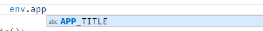
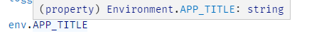

# TypeScript Project Template

## Installation

1. Replace MY_APP with the name of your app project-wide
2. `npm i`

## Development

Run a dev test with `npm run dev`

## Running Tests

To run unit tests, `npm run test`

## Compiling

To compile a build, run `npm run build`. The build output will appear in the `./dist` folder

## More

### Environment Variables

Environment variables should be set in .env

To add additional environment variables, edit `src/environment.ts`:

```typescript
/**
 * Environment Variables Schema
 */
export interface Environment
{
	APP_TITLE: string

	// TODO: Add additional allowed variables
};

/**
 * Default Values
 */
var defaults: Environment = {
	APP_TITLE: 'MY_APP'

	// TODO: Set default variables here
};
```

You'll now have editor hints on environment variables:



and type-checking:


